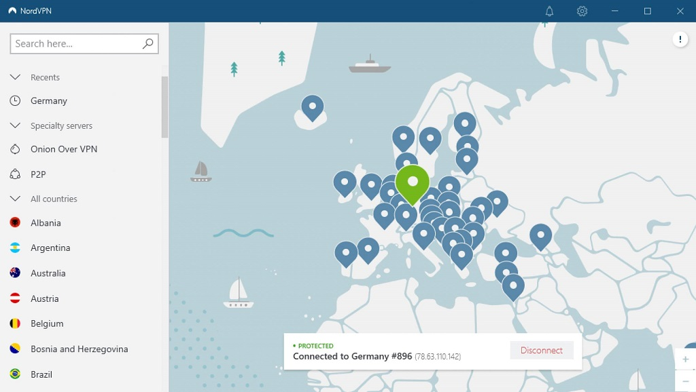

	

	<header class="entry-header">
		<h1 class="page-title" title="如何用VPN日本節點獲取日本IP地址，解除地域限制" itemprop="headline" >如何用VPN日本節點獲取日本IP地址，解除地域限制</h1>
		<time class="ct-meta-element-date" datetime="2022-02-12T16:21:46+08:00" >更新：2022年02月12日</time></li></ul>	</header>

		
		
		

    

    <a href="#ri_ben_shi_xing_de_yu_xian_zhi_de_fu_wu">
                日本施行地域限制的服務
    </a>
    

    <a href="#ri_benVPN_tui_jian_huo_qu_ri_benIP_jie_chu_de_yu_xian_zhi">
                日本VPN推薦，獲取日本IP，解除地域限制
    </a>
    

    <a href="#ExpressVPN">
                ExpressVPN
    </a>
    

    <a href="#SurfShark">
                SurfShark
    </a>
    

    <a href="#NordVPN">
                NordVPN
    </a>
    

    <a href="#VyprVPN">
                VyprVPN
    </a>
    

    <a href="#PandaVPN">
                PandaVPN
    </a>
    

    <a href="#chang_jian_wen_ti">
                常見問題
    </a>
    

    <a href="#wei_shen_me_you_shi_lian_shang_ri_ben_jie_dian_hai_shi_ti_shi_wu_fa_fang_wen">
                為什麼有時連上日本節點還是提示無法訪問？
    </a>
    

    <a href="#kan_bu_dong_ri_wen_ru_he_shi_yong_ri_wen_wang_zhan">
                看不懂日文如何使用日文網站？
    </a>
    

    <a href="#wei_shen_me_bu_yong_mian_fei_ri_benVPN">
                為什麼不用免費日本VPN？
    </a>
    

    <a href="#lian_shang_ri_ben_jie_dian_hou_yongP2P_xia_zai">
                連上日本節點後用P2P下載？
    </a>
    

    <a href="#cong_ri_ben_shi_xun_wang_zhan_xia_pian">
                從日本視訊網站下片？
    </a>
    

    <a href="#wang_you_yan_chi_wen_ti">
                網遊延遲問題
    </a>
    

獲取日本IP地址，解除諸多網路服務的<a href="https://www.youtube.com/watch?v=Vtw7U5oMsJk" target="_blank">地域限制</a>指網站或線上服務，因版權保護等原因，試圖只允許來自特定國家或地區的使用者訪問的限制，服務商通常根據使用者網路請求中的IP地址判斷使用者所在國家和地區，但這種判斷並不可靠，使用者通常較容易通過VPN或代理上網工具獲得非受限國或地區的IP地址，從而繞過限制。，是日本VPN的最大用途。如果你是VPN新手，我們推薦您使用<a href="#expressvpn">ExpressVPN</a>，這是目前最可靠的日本VPN。

|  梯子推荐榜   | 推荐指数 | 官网地址  | 备用网址1 | 备用网址2 |
|  ----  | ----  | ---- | ---- | ---- |
| Nord梯子 | ⭐⭐⭐⭐⭐ | [Nord官网地址](https://go.nordlocker.net/aff_c?offer_id=15&aff_id=38201&url_id=6063&aff_sub=gitfqmama&aff_click_id=tizi) | [Nord备用地址1](http://get.affiliatescn.net/aff_c?offer_id=153&aff_id=38201&source=github&aff_sub=gitfqmama&aff_sub2=tizi) | - |
| Express梯子 | ⭐⭐⭐⭐ | [Express官网地址](https://www.xvbelink.com/?a_fid=tizi_vpn&chan=gitfqmama&data1=tizi) | [Express备用地址1](https://www.xvuslink.com/?a_fid=tizi_vpn&chan=gitfqmama&data1=tizi) | - |
| Ivacy梯子 | ⭐⭐⭐⭐ | [Ivacy中文地址](https://www.ivacykodi.com/easter-deal-2020/?aff=91814&data1=gitfqmama&data2=tizi) | [Ivacy官网地址1](https://billing.ivacy.com/page/91814/6f38cc97/CHN/gitfqmama/tizi) | [Ivacy官网地址2](https://www.ivacy.com/best-vpn-deal-of-2022/?aff=91814&source=Aff&data1=gitfqmama&data2=tizi) |
| 熊猫梯子 | ⭐⭐⭐ | [Panda官方网址](https://www.pankvyh.xyz/r/22216799) | [Panda备用地址1](https://www.pantoto.xyz/r/22216799) | [Panda备用地址2](https://pandavpnpro.com/r/22216799) |

<h2>日本施行地域限制的服務</h2>

你可能還不知道，Netflix日本區擁有全球最龐大的流媒體點播視訊庫。諸多線上“風俗”站點可能也是你使用日本VPN的原因：）

下面列出一些日本國內僅限日本IP訪問的線上服務，以視訊和遊戲居多。有的服務只是限制IP地址，有的要提供日本本國居住身份資訊才能使用，好在這樣的服務不多，絕大多數時候我們都可以通過連線VPN在日本的節點獲取日本IP地址解除<a href="https://www.youtube.com/watch?v=Vtw7U5oMsJk" target="_blank">地域限制</a>指網站或線上服務，因版權保護等原因，試圖只允許來自特定國家或地區的使用者訪問的限制，服務商通常根據使用者網路請求中的IP地址判斷使用者所在國家和地區，但這種判斷並不可靠，使用者通常較容易通過VPN或代理上網工具獲得非受限國或地區的IP地址，從而繞過限制。。

<ul><li><a href="https://www.fujitv.co.jp/" class="rank-math-link" target="_blank" rel="noopener">富士電視臺</a>：視訊類內容限制</li><li><a href="https://www.nhk.or.jp/" class="rank-math-link" target="_blank" rel="noopener">NHK</a>：視訊類內容限制</li><li><a href="https://www.tv-asahi.co.jp/" class="rank-math-link" target="_blank" rel="noopener">朝日電視臺</a>：視訊類內容限制</li><li><a href="https://gyao.yahoo.co.jp/" class="rank-math-link" target="_blank" rel="noopener">雅虎日本視訊區</a>：整站限制</li><li><a href="https://www.netflix.com/jp/" class="rank-math-link" target="_blank" rel="noopener">Netflix日本</a>：整站限制</li><li><a href="https://tver.jp/" class="rank-math-link" target="_blank" rel="noopener">TVer</a>：整站限制</li><li><a href="https://disneyplus.disney.co.jp/" class="rank-math-link" target="_blank" rel="noopener">Disney+日本</a>：整站限制</li><li><a href="https://line.me/ja/" class="rank-math-link" target="_blank" rel="noopener">LINE</a>：貼圖與部分功能</li><li><a href="https://www.nintendo.co.jp/" class="rank-math-link" target="_blank" rel="noopener">Nintendo</a>：商店限區</li><li><a href="https://www.apple.com/jp/app-store/" class="rank-math-link" target="_blank" rel="noopener">日本APP STORE</a>：商店限區</li><li><a href="https://na.leagueoflegends.com/ja-jp/" class="rank-math-link" target="_blank" rel="noopener">英雄聯盟日本</a>：伺服器分割槽與玩家賬號限制</li><li><a href="https://www.playstation.com/ja-jp/" class="rank-math-link" target="_blank" rel="noopener">PlayStation日服</a>：商店限區</li></ul>

<h2>日本VPN推薦，獲取日本IP，解除地域限制</h2>

        

<h3>ExpressVPN</h3>

<a class="wp-block-button__link" href="https://www.xvuslink.com/?a_fid=tizi_vpn&chan=gitfqmama&data1=tizi" rel="nofollow noopener" target="_blank">ExpressVPN官方網站</a>

ExpressVPN日本提供刪除機房節點：

<ul><li>東京：支援LIGHTWAY（UDP+TCP）、傳統OPENVPN、L2TP/IPSEC、IKEV2協議</li><li>東京-2：支援LIGHTWAY（UDP+TCP）、傳統OPENVPN、IKEV2協議</li><li>橫濱：支援LIGHTWAY（UDP+TCP）、傳統OPENVPN、IKEV2協議</li></ul>

每一處節點的IP地址是隨機的，這些日本IP的可用性很高。

可能是網際網路上口碑最好的VPN。

支援 <a href="https://www.youtube.com/watch?v=HZqZ5oMBJ7A" target="_blank">Kill Switch</a>網路在VPN與非VPN間切換時（如VPN軟體正在連線或暫時斷線）會臨時阻止出口流量，防止資料洩露。 和<a href="https://www.youtube.com/watch?v=25maiR0IeRw" target="_blank">隧道拆分</a>VPN客戶端選擇性地決定哪些APP或到某些網址的訪問流量經過或不經過VPN加密通道。。

市場上最全面的裝置支援，從Windows，到Chrome，到Nintendo Switch。

經第三方審計的無日誌政策，無硬碟的伺服器，斷電即擦除，已被<a href="https://en.wikipedia.org/wiki/ExpressVPN#Assassination_of_Andrei_Karlov" class="rank-math-link" target="_blank" rel="noopener">國際事件</a>證實。如果你重視上網隱私，你應該首先考慮ExpressVPN，在隱私保護這一點上，沒有任何一個VPN比它做得更好。

支援同時5臺裝置連線。

一流的 DNS洩露 防範機制，每個節點都部署受保護的DNS伺服器。

簡單好用的客戶端。

中國翻牆能用。

價格高。

中國能用的節點不多：香港、日本、新加坡、洛杉磯。

雖然ExpressVPN仍能用來從中國翻牆，但不再提供中國映象站，不再接受支付寶付款。

<a class="wp-block-button__link" href="https://www.xvuslink.com/?a_fid=tizi_vpn&chan=gitfqmama&data1=tizi" rel="nofollow noopener" target="_blank">ExpressVPN官方網站</a>

<h3>NordVPN</h3>

<a class="wp-block-button__link" href="http://get.affiliatescn.net/aff_c?offer_id=153&aff_id=38201&source=github&aff_sub=gitfqmama&aff_sub2=tizi" rel="nofollow noopener" target="_blank">NordVPN官方網站</a>

SurfShark日本節點支援OPENVPN、IPSEC/IKEV2、P2P，官方未披露具體位置，但如果你在尋找觀看日本Netflix的VPN，它可能是價效比最高的。

Netflix日本擁有世界上最大的獨家節目庫，有1200部其他地方無法訪問的電影和節目，例如《被盜的身份》或《石博士》。內容從最新的節目和動漫到歷史上的經典和獨立電影。

不限裝置數量。

自動攔截廣告和惡意軟體。

支援所有主流作業系統，提供Chrome、Firefox外掛。

支援<a href="https://www.youtube.com/watch?v=25maiR0IeRw" target="_blank">隧道拆分</a>VPN客戶端選擇性地決定哪些APP或到某些網址的訪問流量經過或不經過VPN加密通道。。

30天無理由退款。

接受加密貨幣支付。

接受支付寶支付。

P2P速度慢。

可以用來從中國翻牆但不穩定。

<h3>NordVPN</h3>

<a class="wp-block-button__link" href="http://get.affiliatescn.net/aff_c?offer_id=153&aff_id=38201&source=github&aff_sub=gitfqmama&aff_sub2=tizi" rel="nofollow noopener" target="_blank">NordVPN官方網站</a>

NordVPN擁有80+日本伺服器，支援P2P，支援NordLynx、IKEV2/IPSEC、OPENVPN協議。

基於 <a href="https://www.wireguard.com/" target="_blank">WireGuard</a>一种比传统VPN协议更高效更安全的加密传输协议。 的輕量VPN協議，為大流量網路應用而優化。

支援P2P。

經過三方審計的無日誌政策。

支援所有作業系統，支援同時6臺裝置訪問。

提供Chrome、Firefox瀏覽器外掛。

支援 <a href="https://www.youtube.com/watch?v=HZqZ5oMBJ7A" target="_blank">Kill Switch</a>網路在VPN與非VPN間切換時（如VPN軟體正在連線或暫時斷線）會臨時阻止出口流量，防止資料洩露。 。

支援<a href="https://www.youtube.com/watch?v=25maiR0IeRw" target="_blank">隧道拆分</a>VPN客戶端選擇性地決定哪些APP或到某些網址的訪問流量經過或不經過VPN加密通道。。

提供固定地區的私有IP，每年70美金，每個IP同時供2臺裝置使用。

自動遮蔽廣告和惡意網站。

接受比特幣支付。

只有部分節點支援P2P。

並非所有客戶端都支援<a href="https://www.youtube.com/watch?v=25maiR0IeRw" target="_blank">隧道拆分</a>VPN客戶端選擇性地決定哪些APP或到某些網址的訪問流量經過或不經過VPN加密通道。。

需要在客戶端區分混淆與非混淆伺服器，令人費解，為什麼不為所有節點開啟更安全的混淆服務。

中國大陸使用極不穩定。

<a class="wp-block-button__link" href="http://get.affiliatescn.net/aff_c?offer_id=153&aff_id=38201&source=github&aff_sub=gitfqmama&aff_sub2=tizi" rel="nofollow noopener" target="_blank">NordVPN官方網站</a>

<h3>PandaVPN</h3>

PandaVPN提供的日本東京和大阪的節點，全線BGPA線路，大量NETFLIX IP。

<a class="wp-block-button__link" href="https://www.pantoto.xyz/r/22216799" rel="nofollow noopener" target="_blank">PandaVPN官方網站</a>

由在美華人開發。

中國能用，節點多，線路優。

為不同應用場景而優化的節點。

支援所有主流作業系統。

提供IPLC專線。

7天無理由退款。

接受支付寶付款。

不支援 <a href="https://www.youtube.com/watch?v=HZqZ5oMBJ7A" target="_blank">Kill Switch</a>網路在VPN與非VPN間切換時（如VPN軟體正在連線或暫時斷線）會臨時阻止出口流量，防止資料洩露。 ，自帶的智慧模式並不可靠。

偶有IP洩露。

<a class="wp-block-button__link" href="https://www.pantoto.xyz/r/22216799" rel="nofollow noopener" target="_blank">PandaVPN官方網站</a>

<h2>常見問題</h2>

<h3 class="rank-math-question ">為什麼有時連上日本節點還是提示無法訪問？</h3>

有些服務為了防止使用者用VPN繞過<a href="https://www.youtube.com/watch?v=Vtw7U5oMsJk" target="_blank">地域限制</a>指網站或線上服務，因版權保護等原因，試圖只允許來自特定國家或地區的使用者訪問的限制，服務商通常根據使用者網路請求中的IP地址判斷使用者所在國家和地區，但這種判斷並不可靠，使用者通常較容易通過VPN或代理上網工具獲得非受限國或地區的IP地址，從而繞過限制。，會把一些VPN服務的日本節點IP地址也加入黑名單，別擔心，這個問題通常不難解決，只需要重新連線一個不同的日本節點即可，上面推薦的日本VPN都提供多個日本節點，東京不行可以試試橫濱，VPN的IP地址更新很快，服務商很難一網打盡。

<h3 class="rank-math-question ">看不懂日文如何使用日文網站？</h3>

使用瀏覽器的網頁翻譯功能就可以：<a class="rank-math-link" href="https://support.google.com/chrome/answer/173424?co=GENIE.Platform%3DDesktop&amp;hl=zh-Hant" target="_blank" rel="noopener">變更 Chrome 的顯示語言及翻譯網頁</a>。這樣就可以在開啟日文網頁時得到瀏覽器的提示，選擇把網頁文字翻譯到繁體中文即可。

<h3 class="rank-math-question ">為什麼不用免費日本VPN？</h3>

絕大多數免費的日本VPN雖然能提供日本IP地址，但並不可靠，因為IP是已列表的形式公開在網站上的，所以很快被日本本地各種服務遮蔽。比如日本筑波大學研製的VPNGate服務（由使用者分享）提供大量免費的日本節點，但如果你有心去嘗試這些節點就會發現，拿它們突破<a href="https://www.youtube.com/watch?v=Vtw7U5oMsJk" target="_blank">地域限制</a>指網站或線上服務，因版權保護等原因，試圖只允許來自特定國家或地區的使用者訪問的限制，服務商通常根據使用者網路請求中的IP地址判斷使用者所在國家和地區，但這種判斷並不可靠，使用者通常較容易通過VPN或代理上網工具獲得非受限國或地區的IP地址，從而繞過限制。的可行性並不高，某些節點短時間內或許可用，但會很快用不了。

<h3 class="rank-math-question ">連上日本節點後用P2P下載？</h3>

日本法律嚴禁P2P下載，實際上你很難找到支援P2P的日本VPN，即使你的電腦開啟此類下載軟體，你的VPN提供商也不會允許它發起任何連線。試圖通過連線日本VPN節點使用P2P下載軟體的努力是徒勞的。香港與臺灣的VPN節點更適合P2P下載。

<h3 class="rank-math-question ">從日本視訊網站下片？</h3>

這應該是可行的，也不違法，因為對視訊網站來說，你和正常日本訪客沒有區別，只要網站本身提供下載連結，或者你也可以用第三方視訊解析下載工具，你就可以把網站視訊下載到本地。

<h3 class="rank-math-question ">網遊延遲問題</h3>

如果你從臺灣連上日本VPN節點，打網遊的延遲應該在100ms以下，但從香港或中國大陸連線的延遲即很難講了，尤其是中國大陸到日本的線路並不穩定。

		

|  梯子推荐榜   | 推荐指数 | 官网地址  | 备用网址1 | 备用网址2 |
|  ----  | ----  | ---- | ---- | ---- |
| Nord梯子 | ⭐⭐⭐⭐⭐ | [Nord官网地址](https://go.nordlocker.net/aff_c?offer_id=15&aff_id=38201&url_id=6063&aff_sub=gitfqmama&aff_click_id=tizi) | [Nord备用地址1](http://get.affiliatescn.net/aff_c?offer_id=153&aff_id=38201&source=github&aff_sub=gitfqmama&aff_sub2=tizi) | - |
| Express梯子 | ⭐⭐⭐⭐ | [Express官网地址](https://www.xvbelink.com/?a_fid=tizi_vpn&chan=gitfqmama&data1=tizi) | [Express备用地址1](https://www.xvuslink.com/?a_fid=tizi_vpn&chan=gitfqmama&data1=tizi) | - |
| Ivacy梯子 | ⭐⭐⭐⭐ | [Ivacy中文地址](https://www.ivacykodi.com/easter-deal-2020/?aff=91814&data1=gitfqmama&data2=tizi) | [Ivacy官网地址1](https://billing.ivacy.com/page/91814/6f38cc97/CHN/gitfqmama/tizi) | [Ivacy官网地址2](https://www.ivacy.com/best-vpn-deal-of-2022/?aff=91814&source=Aff&data1=gitfqmama&data2=tizi) |
| 熊猫梯子 | ⭐⭐⭐ | [Panda官方网址](https://www.pankvyh.xyz/r/22216799) | [Panda备用地址1](https://www.pantoto.xyz/r/22216799) | [Panda备用地址2](https://pandavpnpro.com/r/22216799) |
